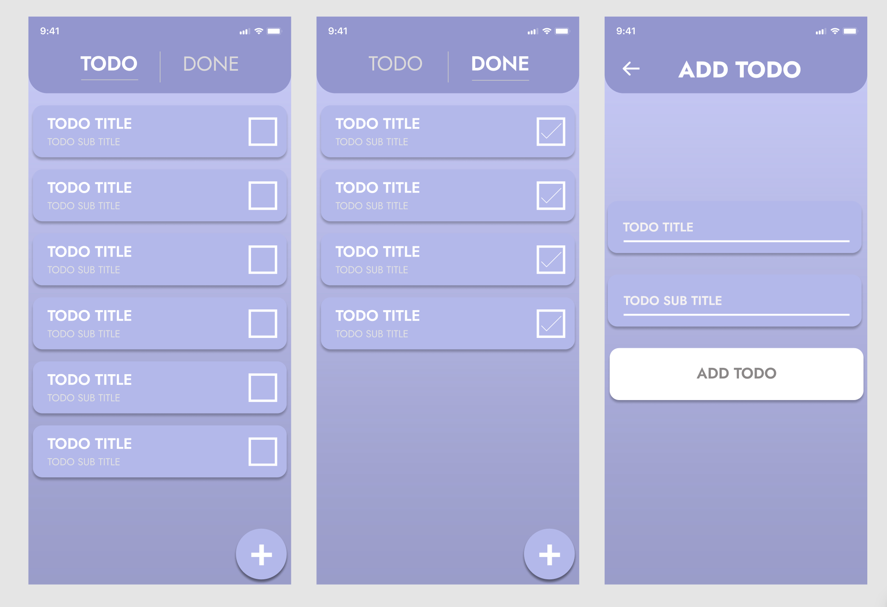

# Todo App



## Start project

```sh
# clone your project from github
# Using cmd
git clone "your_git_repository"

cd react-native-todoapp-for-trainee

# install dependencies
yarn

# Running
yarn android

# or

yarn ios
```

### Todos

- Setup navigation
- Design Todo screens
- Fetch todos to list
- Toggle todo completed or incompleted
- Filter only completed
- Desgin add todo screen
- Add button delete to the list
- Edit Todo
